# Greenstride (UX Design for User-Centric Front End Milestone Project) 

# Table of Contents
1. [Introduction](#intro) 
2. [UX](#UX)
3. [Features](#features)
4. [Technologies](#tech)
5. [Testing](#testing)
6. [Deployment](#deployment)
7. [Credits](#credits)
8. <a href="https://jmortifee.github.io/interactiv-frontend/" target="_blank">Site</a>

## Introduction 
For this project, I have decided to develop a memory game in JavaScript. The overall goal of the project will be to create an attractive and intuitive game that shows of the work of an artist, directing traffic and inquiries to their site. The website contains only one page in which the game will be displayed, comprising of custom HTML5 and a supporting CSS3 style document as well as a JavaScript file.

## UX 

Users who use this site could be simply there to play the game however the use of an artist art gives the user a beautiful and enjoyable experience as well as directing people onto the artist site, hopefully generating them sales. To ensure users enjoy the game as well as the art the page must look aesthetically pleasing and the functionality of the page must run smoothly.

### User Stories

Below are two user stories:

__User story 1:__ The user wants to play a game that is fun and looks good and is easily understandable.

__Solution to user story 1:__ When the user loads the page they will see a simple clean page with a title explaining what this game is and a brief sentence about how to play.

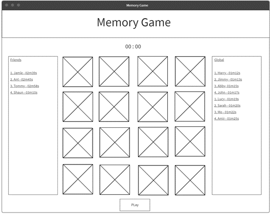

__User story 2:__ When the user has played the game and has spent time looking at the art, they may want to look at more of the artists work.

__Solution for user story 2:__  Once you have won or lost the game a link will pop up with a description directing the users that want to view more to the artists site.

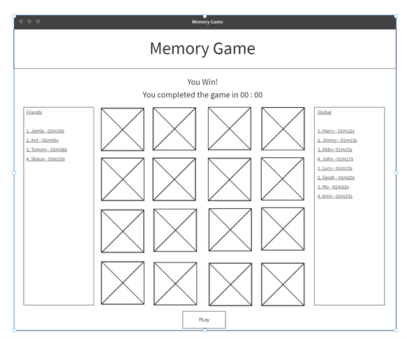

## Features 

__Game:__ The game allows the users 10 seconds to memorise the locations of the pairs of art images, before having to click the tiles to guess the locations.

__Art Tiles:__ The tiles on which the game is played have a front and a back side. The front being the art that has been assigned to that tile, and the back which will be identical across all cards.

__Flip:__ This flips the card when it has been selected so that you can see the art.

__Card assigning:__ This feature that assigns a piece of art to a tile. 

__Check match:__ This checks weather the two selected tiles are the same.

__Lives:__ This gives the user a fail parameter to the game.

__Check end:__ This checks weather the user has won or lost.

__EndGame:__ This reveals an end game message as well as revealing any remaining cards.

__Replay:__ This allows the user to play again.

__Timer:__ This is a timer that records how long it took the user to win the game.

__Share score:__ This allows the website to be easily shared and will also draw other users in to beat their friends score.

__Account creation:__ This allows a user to return later to the game and view their high scores.

__High score table:__ This allows users to view the high scores recorded across various categories.

### Existing Features

__Game:__ This feature is the combination of the below features which allows the user to play a tile matching memory game. this game can be used to measure and improve the users memory skills, while simultaneously advertising what is on the cards.

__Art tiles:__ This feature allows me to put any image onto the tiles and so can be used to advertise many different things. for this project it will be utilising the work of an artist.

The use of this will make the game look pretty while also advertising the clients art.

There are 8 different artworks to create the 8 pairs of tiles. these images are assigned to an id in the CSS. That id is then assigned to a tile when the user presses play, with the card assignment feature  

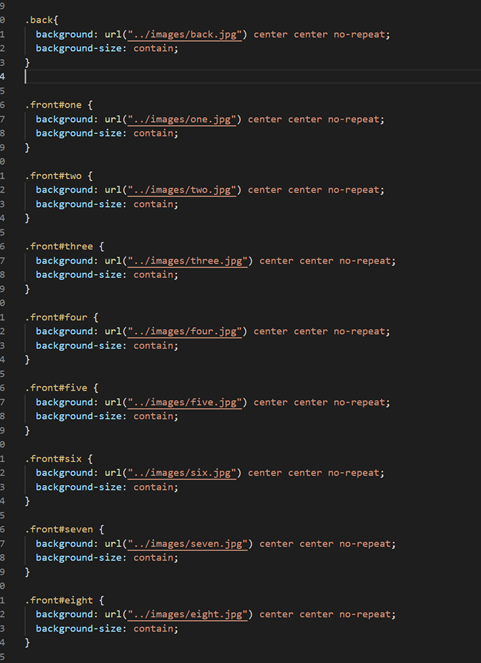

__Flip:__ This feature flips the card when selected by removing the html class back and adding the class front. These classes are then either kept or removed after the check match feature has run.

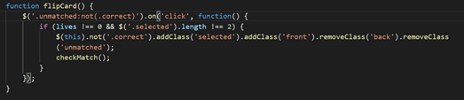

__Card assigning:__ This feature uses 2 functions to assign the art to different cards .

the first function shuffle selects a random string from an array using its index. this code generates a random number between 0 and 15(the length of the array) this then runs the function assign for each iteration of the loop. This generates a new array in a different order to the original, shuffling the deck. 

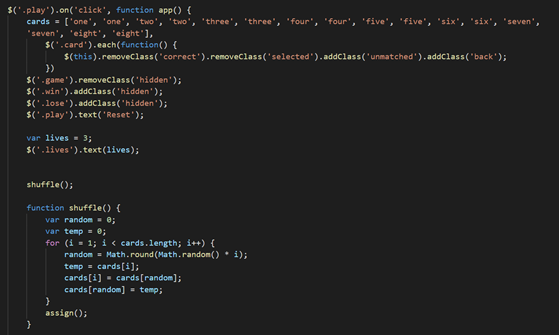

The second function assign gives the string of the index that is the index 

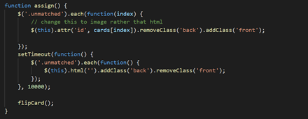

__Check match:__ This feature is a segment of code that will run when the number of selected cards is equal to 2 by using the number of selected classes on the page. 

It works by comparing the id's of the 2 cards that have the class selected.

if the id's Match then the class correct will be added to the cards and then removes the classes, selected, back, and unmatched, while adding the class front to the cards with the class correct. 

If the id's do not match then the program will flip the cards back over by removing the classes selected and front and adding the classes unmatched and back. This statement will also run the lose life function which will be explained in the lives feature.

at least one of the above processes will happen through the use of an if statement so within them the game will check if the user has won or lost. These features will be explained in the Check end feature.

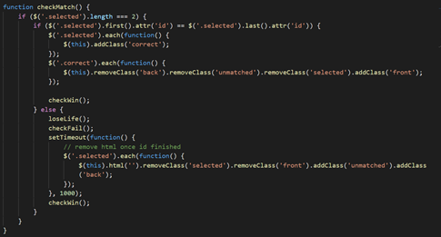

__Lives:__ This feature allows the user to have lives. if selected cards don’t match then the user loses a life.

This is a function embedded within the check match function. if the check match function fails the lose life function will run. This function takes 1 away from the current number of lives and then updates the text within the html element with the class lives.

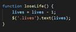

__Check end:__ This feature involves two different functions that check various statuses to see if the user has won or lost the game.

The first is the check Win function that checks the number of unmatched classes it could also use the check matched classes but I didnt do it this way. This function uses an if statement that says if the number of cards with the class unmatched is 0, then the endgame feature is implemented.

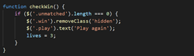

The second function, check fail, uses an if statement that checks if the number of lives, from the lives feature has reached 0. if the statement is true it will then implement the game over features.

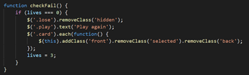

__End game:__ This feature reveals an end game message as well as revealing any remaining cards that have not been flipped.

If the check win function runs then the html element with the class win will have the class hidden removed this is styled in the CSS so that it is not visible until this function runs.

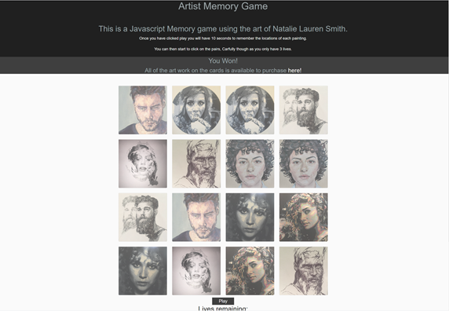

f the check fail function runs then the html element with the class lose will have the class hidden removed this is also styled in the CSS so that it is not visible until this function runs. losing the game would mean that some cards still remained face down so the function also flips all of the remaining cards onto their fronts revealing the locations for the users feedback as well as allowing them to take a closer look at the art.

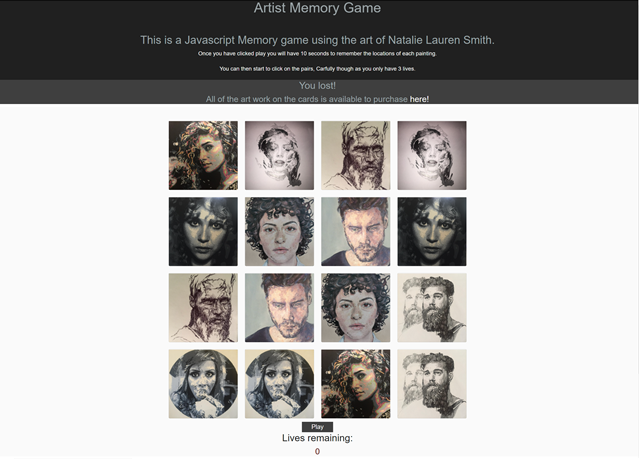

__Replay:__ This feature allows the user to play again if they wish to do so. Within the end game functions there is a line of code that changes the text within the button to play again. this button is what calls the entire game function in the scripts file so it just restarts the entire game. this feature can be used while halfway through a game to reset the game.

### Features Left to Implement

__Timer:__ the timer function would first of all count down the 10 seconds for viewing the tile locations and then track the time it takes for the user to complete the game. this time is what would be used to measure and compare results. 

I didn’t implement this because I couldn’t get to grips with the stop watch function in the time I had to write this project.

__Share score:__ This feature would utilise API's to create a post on a users social media page of the users best score so that they could challenge their friends spreading the page further increasing traffic on this site and subsequently the clients site.

I didn’t implement this because of the same reason as the previous feature.

__Account creation:__ This would allow the users to come back and try and beat their own score at another time. increasing the number of times a single user would return, this would generate more views and clicks on possible embeded adverts.

I would have liked to do this to add depth to this project however with my current knowledge of the language and time constraints I didnt think it was worth pursuing at the moment.

__High score table:__ This feature would lure players back to the site by trying to be the quickest of their friends or even in the world this would also increase the number of times a single user would return, and hence generate more views and clicks on possible embeded adverts.

This feature would only be possible if the account creation feature was implemented so I couldnt do this.

## Technologies 
### HTML5
I Used HTML5 because it is the best language for creating static webpages to be displayed on browsers. it is the most efficient and simple to use and understand.

### CSS3
I Used CSS3 because it is the best language for styling HTML5 webpages

### Bootstrap 4
I used Bootstrap because it uses CSS3 to implement styles into HTML documents via class names. This greatly increases the speed in which a webpage can be generated without having to style every single element on the page. The CSS code can then be overwritten by a custom CSS file or inline styling.

<a href="https://getbootstrap.com/docs/3.4/" target="_blank">Here is a link to the Bootstrap4 website</a>

### Fontawesome
I used Font Awesome because it has a lot of aesthetically pleasing icons that can be easily implemented with a quick copy and paste. they can turn a webpage from being just lines of text to a more interesting minimalist style with small simplistic images to enhance the text.

<a href="https://fontawesome.com/" target="_blank">Here is a link to the Fontawesome website</a>

### Google Fonts
I used Google fonts because it is a great way to implement different fonts into an HTML document with very little effort.

<a href="https://fonts.google.com/" target="_blank">Here is a link to the Google Fonts website</a>

### Balsamiq
I used Balsamiq as it is a good-looking wireframing tool that is easy to manipulate and edit in any way you need. 

<a href="https://balsamiq.com/" target="_blank">Here is a link to the Balsamiq website</a>

### Javascript
I Used JavaScript because it is the best language to be able to implement functionality on a web page.

<a href="https://www.javascript.com/" target="_blank">Here is a link to the JavaScript website</a>

### jQuery
I Used the jQuery library because i felt it made accessing and manipulating html ellements much easier and cleaner.

<a href="https://jquery.com/" target="_blank">Here is a link to the JQuery website</a>

## Testing 

### Code Validation
I started by running my files through the HTML and CSS validator service provided by W3C and my JavaScript file through the beautify tools validator to ensure there were no coding issues. The html and the CSS were completely fine but I missed a few semicolons in the java script which I corrected.

I then proceeded to click on every link and button on the page quickly to try and break the game nothing seemed to break it which was nice. the only issue which I cant fix is that once you have selected two cards you can still flip other cards and see what is on the other side. this is very frustrating as it is possible to cheat slightly. 

### Responsivity
Because I used Bootstraps built in, mobile first, design. The website works well on varying screen sizes. I used several class selectors within the HTML so that bootstraps styling could work its magic. The major styling change that was needed was the size of the cards that was very easily overcome with some media queries in the CSS file.

Mobile layout:

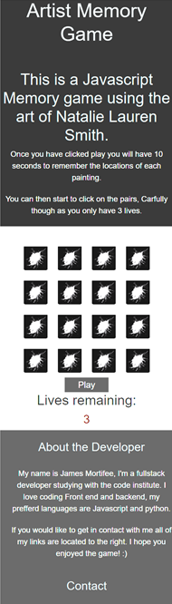 

Large screen size:

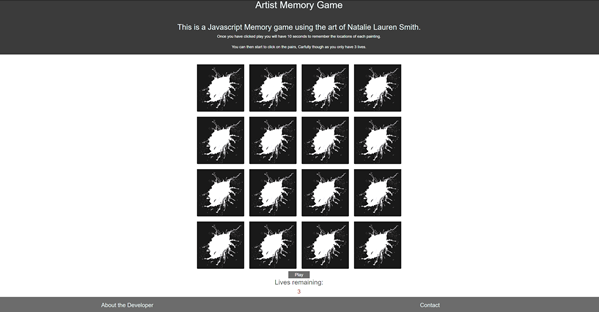

## Deployment 

I used GitHub pages to deploy my site. This tool makes it very easy to deploy your site.
Once all of my files were in there final deployment state, I went to the settings tab of the GitHub Repo I wanted to deploy.

I then scrolled down to the GitHub pages section where I then selected the branch from which to deploy (master):

Within several minutes the site was live at this address: https://jmortifee.github.io/user-centric-front-end/index.html

## Credits 

__Shuffle:__ The random number generator and shuffle function I found on youtube written by Klogue214 on the channel full stack.

<a href="https://www.youtube.com/watch?v=Eq4bUSWGv1Y&t=303s" target="_blank">Here is a link to the youtube video.</a>

<a href="https://codepen.io/klogue214/pen/xwGgRm" target="_blank">Here is a link to the codepen source.</a>

__Card back:__ <a href="https://images.fineartamerica.com/images/artworkimages/mediumlarge/2/white-paint-splash-on-black-background-biwa-studio.jpg" target="_blank">Here is a link to the card back image</a>

Click <a href="https://jmortifee.github.io/interactiv-frontend/" target="_blank">here</a> to view the site.
